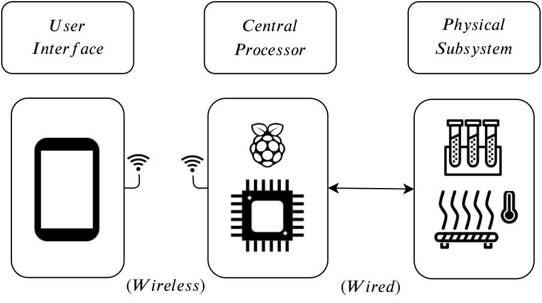
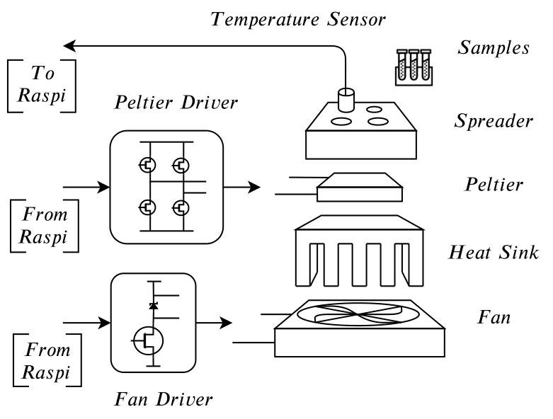
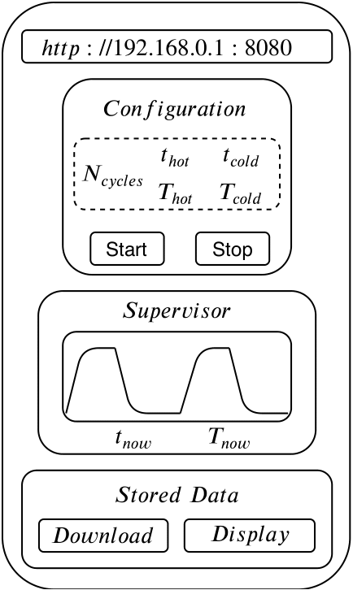
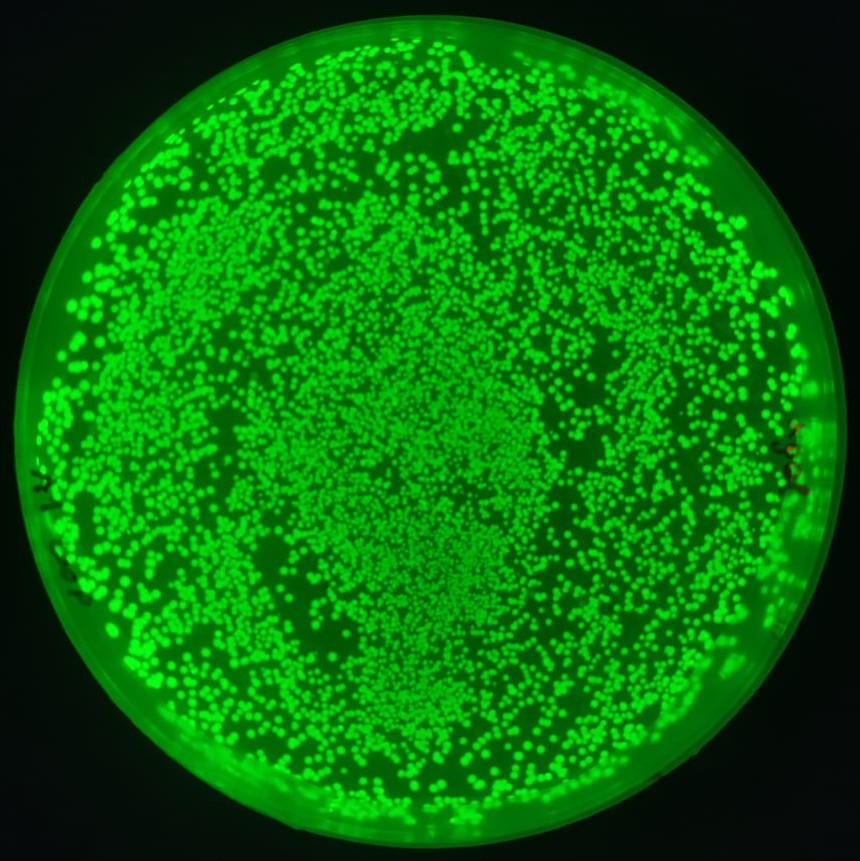

# dna_assembler
Development of a low-cost open-source DNA assembler prototype.

---

## Prototype General Diagram:

**Figure** - General diagram of the prototype composed by a user interface, a central processor and the physical subsystem. Note that the communication between the central processor and the user interface is wireless, while the connection between the processor and the heating-cooling system is wired.

---

## Physical Subsystem Diagram

**Figure** - Detailed diagram of the physical subsystem with the fundamental hardware components, connections and positioning.

---

## User Interface Diagram

**Figure** - Diagram of the user interface which shows the main functionalities that can be performed by the prototype.

---

## Preliminary Results

**Figure** - The prototype works!!!

